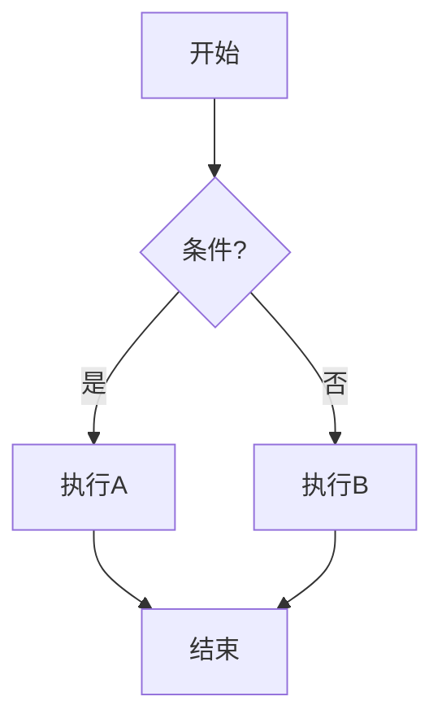
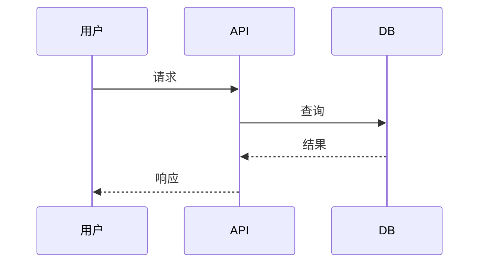
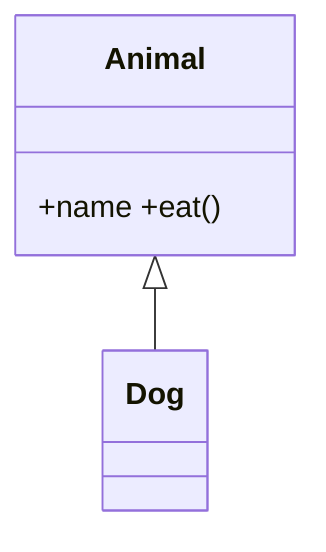

# 算苗科技 Linux 系统软件 C++ 工程师 —— 三天笔试复习计划

> 目标岗位：对标 CUDA 的 AI 算力芯片基础软件栈（驱动 / Runtime / 设备抽象层）
> 关键词：C/C++、Linux 系统调用、多进程/多线程、内核态/用户态驱动、PCIe/字符设备、异构计算 Runtime、并行计算
> 建议：笔试只有选择和判断时，优先背高频结论、易错点和题干关键词；代码实操降级为理解题，不作为主线。

---

## DAY 1 —— C/C++ 语言功底 + Linux 系统编程基础

### 1. C++ 核心（占笔试 30% 以上，必考）
- [x] **内存模型**：栈/堆/BSS/data/text；`new/delete` vs `malloc/free`；`placement new`
- [x] **指针 & 引用**：野指针、悬空指针、`const T*` / `T* const` / `const T* const`
- [ ] **左值/右值、移动语义**：`std::move`、`std::forward`、完美转发、RVO/NRVO
- [x] **智能指针**：`unique_ptr` / `shared_ptr` / `weak_ptr`，循环引用，`make_shared` 与 `shared_ptr` 控制块
- [ ] **多态与虚函数**：vtable 布局、虚析构、纯虚、`override`/`final`、虚继承解决菱形
- [ ] **模板**：函数模板/类模板/可变参模板、SFINAE、`enable_if`、概念（C++20 concepts）
- [ ] **STL 容器底层**：`vector` 扩容、`deque` 分段、`map`(红黑树) vs `unordered_map`(哈希)、迭代器失效规则
- [ ] **C++11/14/17 特性**：`auto`、lambda、`constexpr`、结构化绑定、`std::optional/variant/any`
- [x] **对象生命周期**：构造/拷贝/移动/析构顺序、Rule of 0/3/5、`= default` / `= delete`
- [ ] **类型转换**：`static_cast / dynamic_cast / const_cast / reinterpret_cast` 区别与场景

### 2. 标准 C 库 & 系统调用（高频考点）
- [ ] **文件 I/O**：`open / read / write / close / lseek / fcntl`，O_DIRECT / O_NONBLOCK / O_SYNC
- [ ] **C 库 vs syscall**：`fread` 走 stdio 缓冲、`read` 直接陷内核；`fflush` vs `fsync`
- [ ] **进程**：`fork / vfork / exec / wait / waitpid`，僵尸进程、孤儿进程、`SIGCHLD`
- [ ] **信号**：可重入函数、`sigaction` vs `signal`、信号屏蔽 `sigprocmask`
- [ ] **IPC**：管道、命名管道、消息队列、共享内存（`shm_open + mmap`）、信号量、Unix Domain Socket
- [ ] **mmap**：匿名映射 vs 文件映射、`MAP_SHARED/PRIVATE`、与 `read/write` 性能差异（驱动暴露设备内存常用）
- [ ] **错误处理**：`errno`、线程安全的 `strerror_r`

### 3. 实操（动手 1.5h）
- [ ] 写一个 `producer-consumer`：互斥锁 + 条件变量
- [ ] 写一个简化版 `cp` / `cat`，用 `read/write`，再用 `mmap` 实现一遍，对比性能
- [ ] 写一段代码故意制造内存泄漏，用 `valgrind --leak-check=full` 定位
- [ ] 写一个父子进程通过管道通信的 demo

### 4. 晚上：刷题
- [ ] 反转链表、合并两个有序链表、LRU Cache（`list + unordered_map`）、二叉树层序遍历
- [ ] 手写 `strcpy / memcpy / memmove`（注意重叠区域）、`atoi`、`strstr`
- [ ] 手写线程安全的单例（`static` 局部变量法 + 双检锁 + `std::call_once`）

---

## DAY 2 —— Linux 多线程 / 并发 / 内存管理 / 性能

### 1. 多线程编程（必考重灾区）
- [ ] **pthread**：`pthread_create / join / detach`、属性、TLS（`pthread_key_*` / `thread_local`）
- [ ] **同步原语**：mutex / rwlock / spinlock / 条件变量 / 信号量；何时用自旋锁
- [ ] **C++11 并发**：`std::thread / mutex / lock_guard / unique_lock / condition_variable / future / promise / async / atomic`
- [ ] **内存序**：`memory_order_relaxed / acquire / release / seq_cst`；happens-before
- [ ] **无锁编程**：CAS、ABA 问题、无锁队列思路
- [ ] **常见 bug**：死锁四条件 + 解除策略；活锁；优先级反转；伪共享（False Sharing，cache line 对齐 `alignas(64)`）
- [ ] **线程池**：手写一个固定线程数 + 任务队列的线程池

### 2. Linux 内核 / 内存机制（驱动开发预备）
- [ ] **虚拟内存**：页表（4 级）、TLB、缺页中断、写时复制（COW）
- [ ] **进程/线程内核视角**：`task_struct`、`clone()` 标志位、CFS 调度器、`nice/priority`
- [ ] **用户态 vs 内核态**：syscall 进入流程（int 0x80 / sysenter / syscall 指令）
- [ ] **内存分配器**：glibc ptmalloc 的 arena / fastbin / tcache；jemalloc / tcmalloc 简介
- [ ] **进程地址空间布局**：`/proc/<pid>/maps`、`vm_area_struct`
- [ ] **DMA 与一致性**：cache coherent vs non-coherent DMA、`dma_alloc_coherent`、IOMMU
- [ ] **PCIe 基础**（加分项必考）：Endpoint / Root Complex、BAR 空间、Config Space、MSI/MSI-X 中断、TLP 包

### 3. 性能 & 调试工具（面试常问）
- [ ] **GDB**：断点 / watchpoint / `bt` / `info threads` / coredump 分析（`ulimit -c unlimited`）
- [ ] **perf**：`perf stat / record / report / top`，火焰图
- [ ] **strace / ltrace**：跟踪系统调用 / 库调用
- [ ] **lsof / netstat / ss / iostat / vmstat / mpstat / pidstat / top / htop**
- [ ] **AddressSanitizer / ThreadSanitizer / UBSan**：`-fsanitize=address,thread,undefined`
- [ ] **valgrind / massif / callgrind**

### 4. 实操（动手 2h）
- [ ] 手写一个**线程池** + 提交一批计算任务 + benchmark
- [ ] 写一段有 data race 的代码，用 `-fsanitize=thread` 复现并修复
- [ ] 用 `perf` + 火焰图分析一个矩阵乘法的热点
- [ ] 故意触发段错误，生成 core，用 gdb 定位到行号

### 5. 晚上：常考算法
- [ ] 多线程交替打印 ABC（条件变量 / 信号量两种实现）
- [ ] 生产者-消费者无锁版（`atomic` 环形队列）
- [ ] 大文件去重 / Top K（堆 / 桶排序 / 外排）
- [ ] 字符串：KMP、最长无重复子串、最长回文子串

---

## DAY 3 —— Linux 驱动 / 异构计算 Runtime / 项目话术

### 1. Linux 字符设备驱动（JD 明确要求）
- [ ] **内核模块**：`module_init / module_exit`、`MODULE_LICENSE`、`insmod / rmmod / lsmod / modinfo / dmesg`
- [ ] **字符设备框架**：`alloc_chrdev_region` / `cdev_init` / `cdev_add` / `device_create`
- [ ] **file_operations**：`open / release / read / write / ioctl / mmap / poll`
- [ ] **用户/内核数据交换**：`copy_to_user / copy_from_user / get_user / put_user`
- [ ] **内核内存**：`kmalloc`(物理连续, GFP_KERNEL/GFP_ATOMIC) / `vmalloc`(虚拟连续) / `kmem_cache` / 伙伴系统
- [ ] **同步**：内核 spinlock、mutex、semaphore、RCU、原子操作
- [ ] **中断处理**：上半部 (top half) + 下半部 (softirq / tasklet / workqueue)；request_irq；threaded irq
- [ ] **PCIe 驱动框架**：`pci_driver`、`probe/remove`、`pci_enable_device`、`pci_request_regions`、`pci_iomap`、`ioread32/iowrite32`、DMA mapping API
- [ ] **mmap 把设备 BAR 暴露给用户态**（这是 GPU/AI 卡 Runtime 的关键路径）
- [ ] **UIO / VFIO**：用户态驱动框架（vLLM、DPDK 用 VFIO + IOMMU；类 CUDA Runtime 也常走 VFIO）

### 2. 异构计算 / GPU / CUDA-like Runtime（核心加分项）
- [ ] **CUDA 编程模型**：Host / Device、Grid / Block / Thread、SM、Warp(32 线程)、SIMT
- [ ] **CUDA 内存层级**：Global / Shared / Constant / Texture / Register / Local；coalesced access
- [ ] **CUDA Stream / Event**：异步执行、并发、依赖关系
- [ ] **Runtime API vs Driver API**：`cudaMalloc / cudaMemcpy / cudaLaunchKernel` vs `cuMemAlloc / cuLaunchKernel`
- [ ] **异构 Runtime 关心的事**：
  - 设备发现与初始化（probe PCIe 设备、加载 firmware）
  - 设备内存管理（buddy / slab，VA↔PA 映射，UVA / UVM）
  - 任务调度：command queue / ring buffer / doorbell / fence
  - 同步原语：event、stream、semaphore、interrupt 通知用户态（eventfd / epoll）
  - Host↔Device 通信：DMA、P2P、零拷贝、pinned memory
- [ ] **AI 编译栈**（加分项）：MLIR / LLVM IR、PyTorch dispatcher、vLLM 的 PagedAttention / KV Cache、TVM、Triton
- [ ] **类 CUDA 友商生态**：ROCm/HIP、SYCL/oneAPI、寒武纪 CNRT、华为 CANN/ACL、沐曦 MXMACA、燧原 TopsRider

### 3. 网络（部分笔试会考）
- [ ] TCP 三次握手 / 四次挥手、TIME_WAIT、CLOSE_WAIT
- [ ] `select / poll / epoll`（LT vs ET）；`epoll` 内部红黑树 + 就绪链表
- [ ] Reactor / Proactor 模型；惊群问题；`SO_REUSEPORT`
- [ ] HTTP/HTTPS 基础

### 4. 项目话术与简历准备（晚上 1h）
- [ ] 用 STAR 法则准备 2~3 个项目，每个突出：
  - 系统调用 / 多线程 / 锁优化 / 性能数据（提升 X%）
  - 排查问题的过程：`gdb / perf / strace` 怎么用
  - 如果有内核模块、驱动、PCIe、CUDA、MPI、OpenMP 经验，**重点放最前**
- [ ] 准备"反问"：异构 Runtime 的技术栈 / 团队规模 / 对标 CUDA 的进度

### 5. 实操（动手 1.5h）
- [ ] 在 Ubuntu 上写一个 **Hello 字符设备驱动**：实现 open/read/write/ioctl，从用户态 `cat /dev/hello` 读出数据
- [ ] 写 CUDA 向量加法 `vec_add`，掌握 `<<<grid,block>>>` 启动配置和 `cudaMemcpy`（无 N 卡可用 `nvcc` 在 colab，或用 HIP 在 CPU 模拟）
- [ ] 用 `epoll` 写一个 echo server（≤150 行）

---

## 高频"必背"题清单（笔试常出原题）

### C/C++ 八股
1. `struct` 与 `class` 区别；C 与 C++ 的 `struct` 区别
2. `inline / static / const / volatile / extern` 的多种含义
3. `static` 在函数/全局/类成员中的不同语义
4. C++ 多态实现原理（vptr/vtable），单继承 vs 多继承内存布局
5. `shared_ptr` 是否线程安全？（控制块原子，对象本身不安全）
6. `vector` push_back 的均摊复杂度、扩容因子（GCC 2x，MSVC 1.5x）
7. 哈希冲突解决（开链 / 开放寻址）；`unordered_map` 在什么情况下退化
8. `printf` 是不是线程安全？（glibc 是，MT-safe，但格式化 + write 是分离的）
9. C++ 编译流程：预处理 → 编译 → 汇编 → 链接；静态库 .a vs 动态库 .so
10. extern "C" 的作用（防止 C++ name mangling）

### Linux 八股
1. `fork` 返回值含义；`fork` 后子进程继承哪些资源；COW 原理
2. 进程间通信方式对比，**共享内存为什么最快**（无内核拷贝，但要自己加锁）
3. 线程比进程"轻"在哪里（共享地址空间、文件描述符、信号处理）
4. 死锁的四个必要条件
5. `epoll` 比 `select` 快在哪（无 fd 上限、O(1) 触发、回调机制）
6. 用户态如何感知设备中断？（驱动通过 wait_queue / eventfd / signal 通知）
7. `mmap` 实现零拷贝；`sendfile` 与 `splice`
8. 大端小端判断；写一个判断函数
9. `void *p; sizeof(p) = ?` 在 32/64 位下分别是多少
10. 一个程序从 `main` 到 `exit` 经历了什么（动态链接器、`_start`、构造析构）

### 异构 / GPU 加分题
1. CUDA 中 warp divergence 是什么？怎么避免？
2. shared memory bank conflict 怎么产生？
3. host pinned memory（`cudaHostAlloc`）相比 pageable 的优势
4. CUDA stream 实现并发的原理；默认 stream 的"隐式同步"
5. 为什么 PCIe 上 H2D 拷贝慢？带宽 vs 延迟瓶颈在哪
6. AI 推理 runtime 中 KV Cache 为什么用 PagedAttention（碎片 → 分页）

---

## Linux 常用基础（命令行 / 权限 / Shell / 工具链 —— 选择判断必考）

> 这一节是笔试"白送分"题的来源。面向 C++ 开发的笔试，每场基本都有 5~10 道这类题，**结论必须秒答**。

### 1. 文件与目录命令

| 命令 | 关键用法 / 易错点 |
|---|---|
| `ls -la` | `-a` 显示隐藏文件；首列第一字符表示类型：`-`普通 `d`目录 `l`软链 `c`字符设备 `b`块设备 `p`管道 `s`socket |
| `cd -` | 回到上一个目录 |
| `pwd` | 显示当前绝对路径 |
| `cp -r / mv / rm -rf` | `rm -rf /` 是经典玩笑题；`mv` 同分区是改 inode 链接，跨分区是 copy+delete |
| `ln` | `ln a b` 硬链接（同 inode，不能跨文件系统、不能链目录）；`ln -s a b` 软链接（独立 inode，可跨 fs） |
| `find / -name "*.c" -type f` | `-type f/d/l`；`-mtime -7` 7 天内修改 |
| `which / whereis / type / locate` | `which` 找 PATH 里的可执行；`type` 区分别名/内建 |
| `du -sh *` | 目录大小；`df -h` 文件系统使用率 |
| `tar -czvf x.tgz dir` / `tar -xzvf x.tgz` | c 创建 / x 解压 / z gzip / j bzip2 / v 详细 / f 文件名 |
| `head -n 20 / tail -f` | `tail -f` 实时跟踪日志 |
| `wc -l` | 行数；`-w` 词 `-c` 字节 |
| `stat file` | 看 inode、权限、3 个时间戳：atime/mtime/ctime（**ctime ≠ create time，是 inode 改变时间**） |

### 2. 文件权限（必考 1~2 题）

```
-rwxr-xr--   1 user group  size  date  filename
 │└┬┘└┬┘└┬┘
 │ │  │  └─ other：读
 │ │  └──── group：读+执行
 │ └─────── owner：读+写+执行
 └───────── 类型：- 普通文件
```

- 数字权限：`r=4 w=2 x=1`，`chmod 755 file` = `rwxr-xr-x`
- `chmod u+x file` / `chmod -R 644 dir`
- `chown user:group file` / `chgrp`
- **特殊权限位**：
  - `setuid` (4xxx)：执行时以**文件所有者**身份运行（如 `/usr/bin/passwd`）
  - `setgid` (2xxx)：执行时以**所有组**身份运行；目录上则新建文件继承组
  - `sticky bit` (1xxx)：目录上只有所有者能删自己的文件（如 `/tmp` 的 `drwxrwxrwt`）
- `umask 022` → 新文件 644，新目录 755（用 666/777 减去 umask）
- ❌ "目录没有 x 权限可以 cd 进去" → **错**；x 对目录表示"可进入/可访问其下条目"
- ❌ "硬链接可以指向目录" → **错**（除 root 在某些 fs 上，普通用户不可）
- ✅ "删除文件本质是减少 inode 链接数到 0" → 对

### 3. 文本处理三剑客（grep / sed / awk）

```bash
grep -rn "TODO" .              # 递归 + 行号
grep -E "err|warn" log         # 扩展正则
grep -v "^#"                   # 反向匹配，去掉注释行
grep -i / -w / -c              # 忽略大小写 / 整词 / 计数

sed -n '10,20p' file           # 打印 10-20 行
sed -i 's/foo/bar/g' file      # 原地替换
sed '/pattern/d' file          # 删行

awk '{print $1, $NF}' file     # 第一列和最后一列
awk -F: '{print $1}' /etc/passwd
awk 'NR>1 && $3>100 {sum+=$3} END{print sum}' file
```

- 正则元字符：`. * + ? ^ $ [] () |`，`\d \w \s` 是 Perl 扩展不一定支持
- `grep` 默认 BRE；`grep -E` / `egrep` 用 ERE；`grep -P` 用 PCRE

### 4. 进程 / 系统管理

| 命令 | 用途 |
|---|---|
| `ps aux` / `ps -ef` | 查看所有进程；`aux` 是 BSD 风格，`-ef` 是 SysV 风格 |
| `top` / `htop` | 实时；按 `M` CPU 排序、`P` 内存、`1` 每核 CPU |
| `kill -9 pid` | 9=SIGKILL（不可捕获）、15=SIGTERM（默认，可优雅退出）、2=SIGINT（Ctrl+C）、19=SIGSTOP、18=SIGCONT |
| `jobs / fg / bg / nohup / disown` | 后台作业；`cmd &` 后台运行 |
| `nice -n 10 cmd` / `renice` | 调度优先级，-20（高）~ 19（低） |
| `free -h` | 看内存；**buff/cache 不算"已用"**，必要时会释放 |
| `uname -a / uptime / lsb_release -a` | 系统信息 |
| `lscpu / lspci / lsusb / lsblk / lsmod` | 硬件 / 设备 / 模块 |
| `dmesg \| tail` | 内核日志（驱动调试必看） |
| `journalctl -u xxx -f` | systemd 日志 |
| `systemctl status/start/stop/enable xxx` | 服务管理 |

### 5. I/O 重定向 & 管道

```bash
cmd > file       # 覆盖 stdout
cmd >> file      # 追加 stdout
cmd 2> err       # 重定向 stderr
cmd > out 2>&1   # stderr 合并到 stdout（顺序重要！）
cmd &> out       # bash 简写，等价上面
cmd < input      # 重定向 stdin
cmd1 | cmd2      # 管道（cmd1 stdout → cmd2 stdin）
cmd1 |& cmd2     # 同时把 stderr 也接过来（bash 4+）
cmd <<EOF ... EOF   # heredoc
cmd <<<"string"     # herestring
```

- 文件描述符：**0=stdin, 1=stdout, 2=stderr**（必背！）
- `2>&1 > file` 和 `> file 2>&1` **结果不一样**，前者 stderr 还在终端

### 6. Shell 脚本（bash 基础）

```bash
#!/bin/bash
set -euo pipefail              # 推荐三连：错误退出、未定义变量报错、管道失败传播

var=value                      # 等号两侧不能有空格！
echo $var ${var} "$var"        # 引号区别：双引号会展开，单引号原样
arr=(a b c); echo ${arr[1]} ${#arr[@]}

if [ "$x" -eq 0 ]; then ... fi  # 数字：-eq -ne -lt -le -gt -ge
if [ "$s" = "abc" ]; then ... fi # 字符串：= != -z(空) -n(非空)
if [ -f file ]; then ... fi      # -f 普通文件 -d 目录 -e 存在 -r/-w/-x

for i in {1..10}; do echo $i; done
for f in *.c; do echo $f; done
while read line; do echo "$line"; done < file

func() { echo "$1 $2"; return 0; }
func arg1 arg2

$? 上条命令退出码（0=成功）
$$ 当前 PID    $! 后台 PID    $# 参数个数    $@ / $* 所有参数
$(cmd)  反引号 `cmd` 的现代写法
$((1+2)) 算术运算
```

- ❌ "`var = value` 这样写赋值" → **错**，等号两边不能有空格
- ❌ "`if [$x -eq 0]` 这样写条件" → 错，**`[` 是命令**，前后必须有空格
- ✅ "shell 中变量默认是字符串，比较数字要用 `-eq` 而不是 `==`" → 对（`[[` 内可以用 `==` 字符串比较）

### 7. GCC / G++ 编译选项（必考 2~3 题）

```bash
g++ -Wall -Wextra -O2 -g -std=c++17 -pthread main.cpp -o main
```

| 选项 | 含义 |
|---|---|
| `-E` | 只预处理 |
| `-S` | 编译到汇编（生成 `.s`） |
| `-c` | 编译到目标文件（生成 `.o`），**不链接** |
| `-o name` | 指定输出文件名 |
| `-I dir` | 头文件搜索路径 |
| `-L dir` | 库搜索路径 |
| `-l name` | 链接 `libname.so` 或 `libname.a` |
| `-static` / `-shared` | 静态链接 / 生成动态库（配合 `-fPIC`） |
| `-fPIC` | 位置无关代码（动态库必须） |
| `-O0/-O1/-O2/-O3/-Os/-Ofast` | 优化级别；`-O0` 默认；`-Ofast` 不保证 IEEE 浮点 |
| `-g` / `-g3` | 调试信息 |
| `-Wall -Wextra -Werror` | 警告等级 / 警告当错误 |
| `-D MACRO=val` / `-U MACRO` | 定义 / 取消宏 |
| `-pthread` | 链接 pthread（同时定义 `_REENTRANT`） |
| `-std=c++11/14/17/20` | 语言标准 |
| `-fsanitize=address,undefined,thread` | 三大 sanitizer |
| `-march=native -mtune=native` | 针对本机 CPU 优化（开 SIMD） |

**编译流程**：源码 `.c/.cpp` → `cpp` 预处理 → `cc1` 编译 → `as` 汇编 → `ld` 链接 → 可执行
**静态库** `.a` = `ar` 打包多个 `.o`；**动态库** `.so` = `gcc -shared -fPIC`
**链接顺序**：`g++ main.o -lfoo` 中被依赖的库**放后面**（左→右扫描）

### 8. Make / Makefile（基本必考 1 题）

```makefile
CC      := g++
CFLAGS  := -Wall -O2 -std=c++17
TARGET  := app
SRCS    := $(wildcard *.cpp)
OBJS    := $(SRCS:.cpp=.o)

$(TARGET): $(OBJS)
	$(CC) $(CFLAGS) -o $@ $^

%.o: %.cpp
	$(CC) $(CFLAGS) -c $< -o $@

.PHONY: clean
clean:
	rm -f $(OBJS) $(TARGET)
```

- **必背自动变量**：`$@` 目标、`$<` 第一个依赖、`$^` 全部依赖、`$?` 比目标新的依赖
- **规则缩进必须是 Tab**（不是空格！）—— 经典坑
- `:=` 立即展开 / `=` 延迟展开 / `?=` 仅未定义时赋值 / `+=` 追加
- `.PHONY` 声明伪目标避免和同名文件冲突
- `make -j8` 并行编译

### 9. Git（多人协作必考）

```bash
git init / clone / status / log --oneline --graph
git add . / commit -m "msg" / commit --amend
git diff / diff --staged
git branch / checkout -b / switch / merge / rebase
git push / pull / fetch
git stash / stash pop
git reset --soft/--mixed/--hard HEAD~1
git revert <commit>           # 反向提交（安全）
git cherry-pick <commit>
git tag -a v1.0 -m "..."
```

- `merge` 保留分支历史（产生 merge commit）；`rebase` 把提交"线性"接到目标分支顶（**已 push 的不要 rebase**）
- `reset --soft` 保留改动到暂存；`--mixed` 默认，保留到工作区；`--hard` 全删
- `revert` 安全（新增提交撤销）；`reset --hard` 危险（覆盖历史）
- HEAD / 分支 / tag / 远程跟踪分支 `origin/main` 概念区分

### 10. Vim（最少要会的）

| 模式切换 | `Esc` 回普通；`i a o` 进插入；`:` 进命令；`v V Ctrl-v` 进可视 |
| 移动 | `h j k l` 左下上右；`w b` 词；`0 $` 行首尾；`gg G` 文首尾；`:n` 跳到第 n 行 |
| 编辑 | `dd` 删行；`yy` 复制行；`p` 粘贴；`u` 撤销；`Ctrl-r` 重做；`x` 删字符 |
| 查找替换 | `/pattern` 向下搜；`n / N` 下/上一个；`:%s/old/new/g` 全文替换；`:%s/old/new/gc` 确认 |
| 保存退出 | `:w` 存；`:q` 退；`:wq` / `ZZ` 存退；`:q!` 强退 |
| 多窗口 | `:vs / :sp` 纵/横分屏；`Ctrl-w w` 切换 |

### 11. 网络 / 调试常用

```bash
ip a / ip r                # 替代 ifconfig / route
ping / traceroute / mtr
ss -tlnp / netstat -anp     # 端口监听
curl -v / wget
nc -lv 8080                 # netcat 监听端口（调试神器）
tcpdump -i eth0 port 80 -w cap.pcap
ssh user@host / scp / rsync -av src/ dst/
ldd ./app                   # 查动态链接库依赖
nm -D libfoo.so             # 查符号表
objdump -d a.out / readelf -a / file / strings
strace -e openat ./app      # 跟踪系统调用
ltrace ./app                # 跟踪库调用
```

- `LD_LIBRARY_PATH` 加运行时动态库搜索路径；`LD_PRELOAD` 注入库（hook 调试）
- `ldconfig` 刷新动态库缓存
- ELF 格式：text/data/bss/rodata 段；动态链接表 .plt/.got

### 12. "Linux 基础"判断/选择陷阱合集

1. ✅ 一切皆文件（设备、socket、管道在内核都是 fd）
2. ❌ "ext4 的 inode 中存有文件名" → **错**，文件名在父目录的 dentry 里
3. ❌ "软链接和硬链接都指向 inode" → 错，**软链接是独立文件，存路径字符串**
4. ✅ "硬链接不能跨文件系统、不能指向目录" → 对
5. ✅ "rm 删文件后只要还有进程持有 fd，磁盘空间不会释放" → 对（lsof + deleted）
6. ✅ "管道 `|` 是匿名管道，只能父子/兄弟进程通信" → 对；命名管道 mkfifo 任意进程
7. ❌ "ctime 是文件创建时间" → **错**，是 inode change time
8. ❌ "执行权限对目录无意义" → 错，目录的 x 表示可进入
9. ✅ "shell 中 `()` 开子 shell，`{}` 在当前 shell 执行" → 对
10. ✅ "Ctrl+C 发 SIGINT，Ctrl+Z 发 SIGTSTP" → 对
11. ❌ "kill -9 一定能杀死进程" → 错，**僵尸进程、D 状态（不可中断睡眠）杀不掉**
12. ✅ "shell 中 `0 1 2` 分别是 stdin/stdout/stderr" → 对
13. ✅ "Makefile 命令行必须以 Tab 开头" → 对
14. ✅ "动态库链接顺序：被依赖的放后面" → 对
15. ❌ "静态库 `.a` 在运行时仍需存在" → 错，编译进可执行就脱离了；动态库 `.so` 才需要
16. ✅ "`fork` 后子进程获得父进程文件描述符的副本，但**指向同一个打开文件表项**（共享偏移）" → 对
17. ✅ "Linux 中线程本质是 LWP，`ps -eLf` 可看" → 对
18. ❌ "`free` 显示的 used 越高内存越紧张" → 错，要看 `available`，cache 可回收

---

## 算法与数据结构（判断题 / 选择题专项）

> 笔试形式为**判断题 + 选择题**，所以不用追求手撕代码，重点记**结论、复杂度、边界、对错典型陷阱**。
> 下面每条都是过去笔试常见考点，建议挨个能"秒答对错"。

### 1. 时间 / 空间复杂度（必考）

| 算法/操作 | 平均 | 最坏 | 空间 |
|---|---|---|---|
| 顺序查找 | O(n) | O(n) | O(1) |
| 二分查找（有序数组） | O(log n) | O(log n) | O(1) 迭代 / O(log n) 递归 |
| 冒泡 / 插入 / 选择排序 | O(n²) | O(n²) | O(1) |
| 插入排序（最好，已有序） | **O(n)** | O(n²) | O(1) |
| 希尔排序 | O(n^1.3) | O(n²) | O(1) |
| 归并排序 | O(n log n) | O(n log n) | **O(n)** |
| 快速排序 | O(n log n) | **O(n²)**（已有序+取首/尾为 pivot） | O(log n)~O(n) 栈 |
| 堆排序 | O(n log n) | O(n log n) | O(1) |
| 计数 / 桶 / 基数排序 | O(n+k) | O(n+k) | O(n+k) |
| 建堆（heapify） | **O(n)** | — | O(1) |
| 哈希表查找/插入 | O(1) | **O(n)**（全冲突） | O(n) |
| 红黑树 / AVL 查找 | O(log n) | O(log n) | O(n) |
| BFS / DFS 图遍历 | O(V+E) | — | O(V) |
| Dijkstra（堆优化） | O((V+E) log V) | — | O(V) |
| Floyd 全源最短路 | O(V³) | — | O(V²) |
| KMP 字符串匹配 | O(n+m) | O(n+m) | O(m) |

**易错判断**：
- ❌ "快排平均 O(n log n)，所以最坏也是 O(n log n)" → **错**，最坏 O(n²)
- ❌ "归并排序原地排序" → **错**，需要 O(n) 辅助空间
- ✅ "堆排序、选择排序、希尔排序是不稳定的" → 对
- ✅ "插入排序、冒泡排序、归并排序、基数排序是稳定的" → 对
- ✅ "建堆是 O(n) 不是 O(n log n)" → 对（log n 是单次调整，从下往上累加是等比级数收敛）
- ❌ "二分查找一定要数组" → 链表也能"二分"但失去 O(log n) 优势，本质要求随机访问
- ❌ "哈希表查找一定 O(1)" → 平均 O(1)，最坏 O(n)
- ✅ "递归求 fib 不加 memo 是 O(2^n)" → 对

### 2. 排序算法的"稳定性 / 适用场景"

| 算法 | 稳定 | 原地 | 备注 |
|---|---|---|---|
| 冒泡 | √ | √ | 教学用 |
| 插入 | √ | √ | 小数据 / 接近有序最优 |
| 选择 | × | √ | 几乎从不用 |
| 希尔 | × | √ | 改进版插入 |
| 归并 | √ | × | 链表排序首选；外排序 |
| 快排 | × | √ | 实际最快；要随机化 pivot |
| 堆排 | × | √ | TopK / 优先队列 |
| 计数 | √ | × | 范围小的整数 |
| 基数 | √ | × | 定长字符串 / 整数 |

**陷阱**：STL `std::sort` = 内省排序（IntroSort）= 快排 + 堆排 + 插入排序混合，**不稳定**；要稳定用 `std::stable_sort`（归并）。

### 3. 数据结构小结论（判断题高频）

- **数组 vs 链表**：数组随机访问 O(1)，插入删除 O(n)；链表反之
- **栈**：LIFO，函数调用、表达式求值、括号匹配、DFS
- **队列**：FIFO，BFS、生产者消费者
- **双端队列 deque**：两端 O(1) 插删；STL `deque` 是分段连续，**`&deque[0]` 不是连续内存**（区别于 vector）
- **优先队列**：堆实现，`push/pop` O(log n)，`top` O(1)；STL `priority_queue` 默认**大根堆**
- **二叉树**：n 个节点的二叉树有 **n+1 个空指针**（线索二叉树由来）
- **完全二叉树**：用数组存，节点 i 的左右孩子是 2i+1, 2i+2（0 起）
- **满二叉树**：高 h 有 2^h - 1 个节点
- **平衡二叉树（AVL）**：任意节点左右子树高度差 ≤ 1
- **红黑树**：近似平衡，最长路径 ≤ 2 × 最短路径；插入旋转 ≤ 2 次，删除 ≤ 3 次
- **B / B+ 树**：磁盘/数据库索引（MySQL InnoDB 用 B+ 树）；B+ 树叶子链表便于范围查询
- **哈希**：开链法 vs 开放寻址（线性探测、二次探测、双散列）；负载因子 α 通常 0.75 触发 rehash
- **图**：邻接矩阵 O(V²) 空间；邻接表 O(V+E)；稀疏图用邻接表
- **并查集**：路径压缩 + 按秩合并，单次操作近 O(α(n)) ≈ O(1)
- **Trie 树**：字符串前缀匹配，空间换时间
- **跳表**：期望 O(log n)，Redis 有序集合实现

### 4. 算法范式（选择题常出"属于哪种思想"）

- **分治**：归并排序、快排、二分、大整数乘法、最近点对
- **动态规划**：背包、最长公共子序列(LCS)、最长递增子序列(LIS)、编辑距离、矩阵链乘
- **贪心**：哈夫曼编码、最小生成树（Prim/Kruskal）、Dijkstra、活动选择、找零（仅特定面值）
- **回溯**：N 皇后、子集、全排列、数独
- **分支限界**：0-1 背包、TSP
- **DP 三要素**：状态定义、状态转移方程、边界
- ❌ "Dijkstra 能处理负权边" → **错**，负权要用 Bellman-Ford 或 SPFA
- ❌ "贪心一定能得最优解" → 错，需证明贪心选择性质 + 最优子结构
- ✅ "DP 与分治的核心区别：DP 子问题重叠" → 对

### 5. 离散数学 / 组合 / 概率（笔试常考少量题）

- 排列 A(n,k) = n!/(n-k)!；组合 C(n,k) = n!/(k!(n-k)!)
- C(n,k) = C(n-1,k-1) + C(n-1,k)
- n 个元素的子集数 = 2^n
- 抽屉原理 / 鸽笼原理
- n 个节点的不同二叉树数 = 卡特兰数 C(2n,n)/(n+1)

### 6. 进制 / 位运算（必考 2~3 题）

- **补码**：正数原反补相同；负数 = 反码 + 1；8 位补码范围 [-128, 127]
- **常用技巧**：
  - `x & (x-1)` 清除最低位 1 → 统计 1 的个数 / 判 2 的幂
  - `x & -x` 取最低位 1（树状数组用）
  - `x ^ x = 0`、`x ^ 0 = x` → 找数组中只出现一次的数
  - 不用临时变量交换：`a^=b; b^=a; a^=b;`
  - 判奇偶：`x & 1`
  - 乘 2 = 左移 1 位（**有符号溢出是 UB**）；除 2 = 右移（负数右移结果实现定义）
- **浮点**：IEEE 754；float 32位 = 1 符号 + 8 阶码 + 23 尾数；精度约 7 位十进制；**判等不能用 ==**
- ❌ "0.1 + 0.2 == 0.3" → **错**（浮点精度）

### 7. C/C++ 算法相关易错小题

```c
int a[5] = {1,2,3,4,5};
int *p = a;
sizeof(a)  // 20（数组）
sizeof(p)  // 8（64位指针）
sizeof(a)/sizeof(a[0])  // 5（求长度惯用法）

// 函数参数中的数组退化为指针
void f(int a[10]) { sizeof(a); }  // 8，不是 40！
```

- `i++` 与 `++i`：返回值不同，循环里都是 i+1，但 `++i` 对自定义类型更高效
- 运算符优先级陷阱：`*p++` = `*(p++)`；`a[i]++` 不等于 `(a[i])++` 之外的解释（其实就是它）
- 短路求值：`a && b`，a 为假 b 不求值；`a || b`，a 为真 b 不求值
- `switch` 不加 break 会贯穿（fall-through）
- `for(int i=0; i<n; i++)` 中 `i` 类型用 `int` 与 `size_t` 比较有符号陷阱
- 整数除法向 0 截断（C99 起）；负数取模符号跟被除数

### 8. "选择题陷阱合集"（背下来直接得分）

1. 在 n 个元素无序数组中找第 k 大 → 最优 **O(n)**（快速选择 / BFPRT），不是 O(n log n)
2. 平均查找性能最好的数据结构 → **哈希表 O(1)**
3. 关键字比较次数与初始顺序无关的排序 → **选择排序、堆排序**
4. 不需要额外辅助空间的排序 → 冒泡/插入/选择/快排（递归栈不算）/ 堆排
5. 既适合顺序存储又适合链式存储的排序 → 插入、归并
6. 折半查找的判定树是 → **平衡二叉排序树**，深度 ⌊log₂n⌋+1
7. n 个节点构造的二叉排序树平均查找长度 → O(log n)，**最坏 O(n)**（退化为链）
8. KMP 算法相比朴素匹配的优势 → 主串指针**不回溯**
9. 树的孩子兄弟表示法本质上是 → 把树转成**二叉树**
10. 散列冲突解决：链地址法的优点 → 不会"二次聚集"、删除方便；缺点：指针开销
11. 桶排序时间复杂度 O(n+k) 中的 k 是 → 桶数（数据范围）
12. 完全二叉树第 i 个节点（1-based）的父节点是 → ⌊i/2⌋
13. 后序遍历最后一个节点一定是 → **根**
14. 中序遍历 BST 得到 → **升序序列**
15. 拓扑排序适用于 → **DAG（有向无环图）**

---

## 资料 / 链接（自查）

- 《Linux 高性能服务器编程》游双
- 《UNIX 环境高级编程》APUE
- 《Linux 设备驱动程序》LDD3 + 内核源码 `Documentation/driver-api/`
- 《C++ Primer》《Effective Modern C++》
- CUDA C++ Programming Guide：https://docs.nvidia.com/cuda/cuda-c-programming-guide/
- 牛客网搜索关键词：「沐曦 / 摩尔线程 / 寒武纪 / 燧原 / 壁仞 / 算能 / 海光 + 笔试 / 面经」（与算苗岗位高度同构）
- 知乎搜索：「异构计算 runtime 面试」「类 CUDA 软件栈 面经」
- GitHub：`NVIDIA/cuda-samples`、`ROCm/HIP`、`vllm-project/vllm`（看 `csrc/` 目录的 CUDA kernel 与内存管理）

---

## 时间分配建议（每天 ~10h，可按精力压缩到 6~7h）

| 时段 | 内容 |
|---|---|
| 上午 3h | 知识点速过 + 笔记 |
| 下午 3h | 动手编码 |
| 晚上 2h | 算法刷题 + 面经 |
| 睡前 30min | 错题回顾、第二天计划 |

> 临场 Tips：笔试遇到不会的题先写思路与伪代码；C++ 选择题陷阱多在「构造/析构顺序」「隐式转换」「重载决议」「虚函数表」；driver 题目重点考 `copy_to_user`、并发、中断上下文限制（不能 sleep）。

---

## Markdown 速查（与 AI 工具/Copilot/ChatGPT 高效协作必备）

> 与大模型对话、写 Issue/PR、整理笔记、写技术博客都用 Markdown。掌握这些就能把 AI 输出**直接复制到 GitHub / 飞书 / 语雀 / Obsidian / VS Code 预览**正确渲染。

### 1. 基础语法

```markdown
# 一级标题       ## 二级       ### 三级（最多到 ######）
**粗体**  *斜体*  ***粗斜体***  ~~删除线~~  `行内代码`
> 引用块（前面加 >）
> > 嵌套引用

- 无序列表（- 或 *）
  - 二级缩进 2 空格
1. 有序列表
2. 第二项

- [ ] 待办未完成
- [x] 已完成（GitHub / VS Code / Obsidian 渲染为复选框）

[链接文字](https://example.com)         [带标题](https://x.com "悬停提示")
             
<https://auto-link.com>                  <user@email.com>

---     （三个减号生成水平分割线）

\*转义星号\*    （反斜杠转义特殊字符 \ ` * _ {} [] () # + - . !）
```

### 2. 代码块（与 AI 交互最常用）

````markdown
```cpp
int main() { return 0; }   // 指定语言可高亮
```

```bash
ls -la
```

```diff
- 删除的行
+ 新增的行
```
````

- **告诉 AI 回答时给出的代码必须用 ```` ```语言 ```` 包裹**，否则在 Markdown 渲染器里会丢失高亮
- 常用语言标识：`cpp c python bash sh shell powershell pwsh js ts json yaml toml ini sql html css go rust java kotlin md mermaid plaintext text`
- 行内代码用单反引号：`` `code` ``；包含反引号本身用双反引号：`` `` `code` `` ``

### 3. 表格

```markdown
| 列1 | 列2 | 列3 |
|:---|:---:|---:|
| 左对齐 | 居中 | 右对齐 |
| a | b | c |
```

- 对齐：`:---` 左、`:---:` 居中、`---:` 右
- 表格内换行用 `<br>`；竖线 `|` 要写成 `\|`
- AI 整理对比信息时让它"用 Markdown 表格"输出最直观

### 4. 数学公式（KaTeX / MathJax，AI 公式输出标配）

```markdown
行内：$E = mc^2$，复杂度 $O(n \log n)$

块级：
$$
\sum_{i=1}^{n} i = \frac{n(n+1)}{2}
$$

矩阵：
$$
A = \begin{bmatrix} a & b \\ c & d \end{bmatrix}
$$
```

- 常用：`\frac{}{}` `\sqrt{}` `_下标` `^上标` `\sum \prod \int \lim` `\alpha \beta \theta \pi` `\to \Rightarrow \leq \geq \neq \approx`
- GitHub README 现在原生支持 `$...$` 与 `$$...$$`

### 5. Mermaid 图（在 GitHub / Obsidian / VS Code 中可直接渲染）

````markdown







````

- **请 AI 画图直接说："用 Mermaid 画一个 XXX 流程图"**，比贴图更易复用、可改

### 6. 提示框 / Callout（GitHub Alerts，2024 起原生支持）

```markdown
> [!NOTE]
> 提示信息

> [!TIP]
> 小技巧

> [!IMPORTANT]
> 重要内容

> [!WARNING]
> 警告

> [!CAUTION]
> 危险操作
```

Obsidian 用 `> [!info]` `> [!success]` `> [!question]` 等更多类型。

### 7. 折叠 / 详情（HTML 嵌入）

```markdown
<details>
<summary>点我展开</summary>

这里是隐藏内容，可以放代码块、表格、图片。

</details>
```

- Markdown 允许混入 HTML，常用 `<br>` `<sub>` `<sup>` `<kbd>Ctrl</kbd>+<kbd>C</kbd>` `<details>` `<summary>` ``

### 8. 脚注 / 引用 / 任务

```markdown
这里有个脚注[^1]，再来一个[^note]。

[^1]: 第一个脚注内容
[^note]: 命名脚注

参考链接式：
这是 [Google][g] 和 [Bing][b]
[g]: https://google.com
[b]: https://bing.com
```

### 9. 与 AI 工具协作的"提示词 + Markdown"技巧

| 想要的效果 | 在 prompt 里这样说 |
|---|---|
| AI 输出可直接渲染 | "用 Markdown 格式回答，代码块标注语言" |
| AI 输出对比表 | "用 Markdown 表格列出 X 和 Y 的区别" |
| AI 画流程 / 时序 / 类图 | "用 Mermaid 画……" |
| AI 输出公式 | "用 KaTeX（`$...$` 和 `$$...$$`）写公式" |
| AI 输出可勾选清单 | "用 `- [ ]` 任务列表的形式" |
| 引用大块文本 | 用 ```` ``` ```` 三反引号包住，告诉 AI："以下三反引号内是参考资料，不要修改" |
| 让 AI 严格按格式 | 给一段 Markdown 模板示例，让它**仿写** |

### 10. 常见踩坑（判断对错）

1. ✅ 标题 `#` 后必须有空格 → `# 标题` 对，`#标题` 在严格模式下不渲染
2. ✅ 列表项与上文之间需要空行（CommonMark 严格） → 不空行有时不渲染列表
3. ✅ 代码块 ``` 必须**单独成行**且左侧无缩进 → 否则被当作代码块内容
4. ❌ "Markdown 中可以直接换行" → **错**，单换行只是空格；**段落要空一行**；行尾两空格才强制换行（或写 `<br>`）
5. ✅ 表格上一行必须空行，否则可能不被识别
6. ✅ 嵌套代码块用 4 个反引号包 3 个反引号：```` ```` ```` 内含 ```` ``` ```` ````
7. ❌ "GitHub 和飞书 Markdown 完全一样" → 错；飞书/语雀/钉钉各有方言（如 Mermaid 支持差异、emoji 简写、Alert 写法）
8. ✅ 文件名约定：`.md` 通用；`.markdown` 老式；GitHub 自动渲染 `README.md`
9. ✅ VS Code 中 `Ctrl+Shift+V` 打开预览，`Ctrl+K V` 旁边预览
10. ✅ Copilot Chat / ChatGPT 回复中复制带格式：直接选中 → 复制 → 粘进 `.md` 即保留 Markdown 源码

### 11. 推荐工具链

- **VS Code 插件**：Markdown All in One、Markdown Preview Mermaid Support、markdownlint、Paste Image
- **本地编辑**：Typora（所见即所得）、Obsidian（双链笔记）
- **在线**：StackEdit、HackMD、Dillinger
- **格式化**：`prettier --write *.md`
- **转 PDF / Word / HTML**：Pandoc：`pandoc input.md -o out.pdf --pdf-engine=xelatex -V mainfont="Noto Sans CJK SC"`
- **Mermaid 在线编辑**：https://mermaid.live

