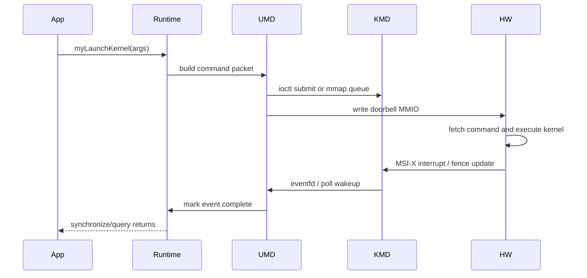

# 复习归档：第 13 次 - DAY 3 异构计算与 CUDA-like Runtime

> 日期：2026-05-13  
> 来源计划：三天复习计划_LinuxC++ - DAY 3 异构计算 / GPU / CUDA-like Runtime  
> 本轮主题：CUDA 编程模型、内存层级、Stream/Event、Runtime API vs Driver API、异构 Runtime、AI 编译栈、友商生态  
> 目标：面向笔试选择判断和面试追问，能把 CUDA 表层 API 与底层驱动、队列、DMA、doorbell、fence 串成完整链路。

---

## 1. 本轮复习范围

- CUDA 编程模型：Host / Device、Grid / Block / Thread、SM、Warp、SIMT
- CUDA 内存层级：Global / Shared / Constant / Texture / Register / Local
- 访存优化：coalesced access、bank conflict、pinned memory
- CUDA Stream / Event：异步执行、依赖、同步、默认 stream
- Runtime API vs Driver API：`cudaMalloc` vs `cuMemAlloc`
- 异构 Runtime：设备发现、上下文、内存管理、任务调度、同步通知
- 命令链路：command queue / ring buffer / doorbell / fence
- Host 与 Device 通信：DMA、P2P、零拷贝、UVA/UVM
- AI 编译栈：MLIR、LLVM IR、PyTorch dispatcher、vLLM、TVM、Triton
- 生态对标：ROCm/HIP、SYCL/oneAPI、CNRT、CANN、MXMACA、TopsRider

---

## 2. CUDA 编程模型

### 2.1 Host 与 Device

| 概念 | 含义 |
|---|---|
| Host | CPU 侧代码和内存 |
| Device | GPU/AI 加速器侧代码和内存 |
| Kernel | 在 device 上并行执行的函数 |
| Thread | 最小执行单元 |
| Block | 一组线程，可共享 shared memory、可同步 |
| Grid | 一次 kernel launch 中的所有 block |
| SM | Streaming Multiprocessor，调度和执行 block/warp 的硬件单元 |
| Warp | NVIDIA 中通常 32 个线程一组，SIMT 执行 |

### 2.2 Grid / Block / Thread

CUDA kernel 启动形式：

```cpp
kernel<<<grid_dim, block_dim, shared_mem, stream>>>(args...);
```

线程全局下标常见写法：

```cpp
int tid = blockIdx.x * blockDim.x + threadIdx.x;
```

必背：

- Grid 由多个 Block 组成。
- Block 由多个 Thread 组成。
- 同一个 Block 内线程可用 `__syncthreads()` 同步。
- 不同 Block 之间通常不能在同一个 kernel 内直接全局同步。
- Warp 是硬件调度执行的基本粒度之一。

### 2.3 SIMT 与 Warp Divergence

SIMT：Single Instruction, Multiple Threads。

同一个 warp 内线程执行同一条指令，但每个线程有自己的寄存器和线程上下文。

Warp divergence：

- 同一个 warp 内线程走了不同分支。
- 硬件通常会串行执行不同分支路径，再合并。
- 会降低并行效率。

优化思路：

- 让同一 warp 内线程尽量走相同分支。
- 把分支按数据分组。
- 减少深层、数据相关的分支。

---

## 3. CUDA 内存层级

### 3.1 内存层级表

| 内存 | 位置 | 速度 | 作用域 | 典型用途 |
|---|---|---:|---|---|
| Register | 每线程私有 | 最快 | Thread | 临时变量 |
| Local | 每线程私有，可能落到全局内存 | 慢 | Thread | 寄存器溢出、大局部数组 |
| Shared | SM 片上 | 快 | Block | 线程块内协作、tile |
| Global | 显存/HBM | 慢 | Grid/全局 | 大数组、输入输出 |
| Constant | 只读常量缓存 | 快，广播友好 | 全局 | 小型只读参数 |
| Texture | 只读缓存/特殊访问 | 场景相关 | 全局 | 空间局部性访问 |

选择题关键词：

- Shared memory 是 block 内共享，不是所有 block 共享。
- Register 是每线程私有。
- Local memory 名字像“本地”，但常位于 global memory，速度可能很慢。
- Global memory 容量大但延迟高。

### 3.2 Coalesced Access

合并访存：同一 warp 内连续线程访问连续、对齐的 global memory 地址，硬件可合并成更少内存事务。

好访问：

```cpp
out[tid] = in[tid];
```

差访问：

```cpp
out[tid] = in[tid * stride];
```

易错：合并访存主要优化 global memory 带宽，不是自动解决所有 cache miss。

### 3.3 Shared Memory Bank Conflict

Shared memory 被分成多个 bank。若同一 warp 多个线程访问同一 bank 的不同地址，可能发生 bank conflict，访问被串行化。

要点：

- 广播同一地址通常可被优化。
- 连续线程访问连续地址通常较好。
- 可通过 padding 改变步长，减少冲突。

---

## 4. Stream 与 Event

### 4.1 Stream

Stream 是 GPU 命令队列抽象。

性质：

- 同一 stream 内操作按提交顺序执行。
- 不同 stream 之间可并发，前提是资源允许且没有依赖。
- 异步 `cudaMemcpyAsync` 需要 pinned host memory 才更容易真正异步。

默认 stream 易错：

- 传统默认 stream 可能与其他 stream 发生隐式同步。
- per-thread default stream 语义下，每个 host 线程有自己的默认 stream。

### 4.2 Event

Event 用于记录某个 stream 中的时间点。

常见用途：

- 计时。
- 建立 stream 间依赖。
- 查询异步任务是否完成。

示意：

```cpp
cudaEventRecord(event, stream_a);
cudaStreamWaitEvent(stream_b, event, 0);
```

含义：`stream_b` 等待 `stream_a` 记录到 event 的位置完成后再继续。

---

## 5. Runtime API vs Driver API

### 5.1 对比表

| 维度 | Runtime API | Driver API |
|---|---|---|
| 前缀 | `cuda*` | `cu*` |
| 抽象层级 | 更高 | 更底层 |
| 初始化 | 隐式较多 | 显式管理 device/context/module |
| 典型函数 | `cudaMalloc` / `cudaMemcpy` / `cudaLaunchKernel` | `cuMemAlloc` / `cuMemcpy` / `cuLaunchKernel` |
| 使用体验 | 简单 | 灵活但复杂 |
| 常见对象 | `cudaStream_t` / `cudaEvent_t` | `CUcontext` / `CUmodule` / `CUfunction` |

### 5.2 类 CUDA Runtime 的分层

```text
App / Framework
  -> Runtime API: myMalloc, myMemcpy, myLaunchKernel
  -> User Mode Driver: context, stream, memory allocator, queue submit
  -> Kernel Mode Driver: ioctl, mmap, interrupt, DMA mapping, PCIe BAR
  -> Hardware: command processor, DMA engine, compute units, HBM
```

笔试高频：

- Runtime API 更易用，Driver API 更接近底层控制。
- Runtime 最终也要调用底层 driver 能力。
- 类 CUDA 自研栈通常分 UMD 和 KMD。

---

## 6. 异构 Runtime 关心的核心问题

### 6.1 设备发现与初始化

KMD：

- PCIe `probe` 发现设备。
- `pci_enable_device`。
- `pci_request_regions`。
- `pci_iomap` 映射 BAR。
- 配置 DMA mask。
- 注册中断 MSI/MSI-X。
- 创建 `/dev/xxx`。

UMD/Runtime：

- 打开 `/dev/xxx`。
- 查询设备属性。
- 创建 context。
- `mmap` doorbell/status page/queue。
- 加载 firmware 或初始化 microcode，视架构而定。

### 6.2 设备内存管理

Runtime 常做：

- 维护 device VA 空间。
- 管理 HBM/显存物理页。
- 建立 VA 到 PA 或 IOVA 的映射。
- 小块分配用 slab/pool，大块分配用 buddy。
- 支持 pinned host memory、zero-copy、UVA/UVM。

概念区分：

| 概念 | 含义 |
|---|---|
| VA | 虚拟地址 |
| PA | 物理地址 |
| IOVA | 设备通过 IOMMU 看到的 I/O 虚拟地址 |
| UVA | Unified Virtual Addressing，统一地址空间编号 |
| UVM | Unified Virtual Memory，统一内存管理，可迁移/按需调页 |

### 6.3 任务调度链路

典型 kernel launch 路径：

1. App 调 `myLaunchKernel`。
2. Runtime 解析 kernel metadata 和参数。
3. UMD 把命令写入 command queue/ring buffer。
4. UMD 写 doorbell MMIO 通知设备。
5. 设备 command processor 拉取命令。
6. Scheduler 分发 block 到计算单元。
7. kernel 执行完成后写 fence/status。
8. 设备发 MSI-X 中断或用户态轮询。
9. KMD 唤醒 wait_queue/eventfd。
10. Runtime 标记 event/stream task 完成。

### 6.4 Mermaid 时序图



---

## 7. Host 与 Device 通信

### 7.1 DMA

DMA 让设备直接读写 host memory 或 device memory，减少 CPU 拷贝参与。

常见方向：

- H2D：Host to Device。
- D2H：Device to Host。
- D2D：Device to Device。
- P2P：Device to Device，可能绕过 host。

瓶颈：

- PCIe 带宽有限。
- 小包传输受延迟影响明显。
- Pageable memory 需要额外 pin/copy，pinned memory 更适合 DMA。

### 7.2 Pinned Memory

Pinned host memory：页锁定内存，不会被换出。

优势：

- 便于 DMA。
- 支持更高效的异步拷贝。
- 可减少中间 bounce buffer。

代价：

- 占用物理内存。
- 过多 pinned memory 会影响系统内存管理。

### 7.3 Zero-copy 与 P2P

Zero-copy：设备直接访问 host pinned memory，减少显式拷贝，但 PCIe 延迟高，不适合频繁随机访问。

P2P：设备间直接通信，适合多卡场景，依赖拓扑、IOMMU/ACS、驱动支持。

---

## 8. 3D 芯片特有考虑

这里的 3D 通常指 3D 堆叠、chiplet、HBM、die 间互联，不是图形 3D。

### 8.1 设计变量

- 多 die 计算单元。
- HBM 分布式带宽。
- NoC/mesh/torus 互联。
- die 间访问延迟不均匀。
- 热点和散热限制。

### 8.2 Runtime 策略

| 问题 | 策略 |
|---|---|
| 数据放在哪个 HBM/die | first-touch、interleave、显式 affinity |
| kernel 分到哪个 die | 数据局部性优先，兼顾负载均衡 |
| 跨 die 同步 | 减少全局 barrier，使用分层同步 |
| 热点访问 | tile 化、cache blocking、数据复制 |
| 性能分析 | 暴露 per-die bandwidth、stall、occupancy 计数器 |

### 8.3 面试表达

如果题目问“在自研 3D 芯片上实现类 CUDA”，不要只讲 CUDA 语法。要回答为一套异构软件栈：

- KMD 负责 PCIe、BAR、DMA、中断、安全隔离。
- UMD/Runtime 负责 context、stream、event、memory、queue。
- Compiler 负责从 kernel 源码到设备 ISA。
- Library/Framework 负责接 PyTorch、vLLM、BLAS/DNN。
- Profiler/Debugger 负责可观测性和性能闭环。

---

## 9. AI 编译栈与框架接入

### 9.1 编译栈

| 层 | 作用 |
|---|---|
| Frontend | CUDA-like C++、DSL、Python graph capture |
| MLIR | 多层 IR，适合表达 tensor、linalg、gpu dialect |
| LLVM IR | 通用优化和后端接口 |
| Backend | 指令选择、寄存器分配、调度、生成设备 ISA |
| JIT | 运行时按 shape/设备特性生成代码 |

TVM / Triton：

- TVM 偏自动调度和多后端 codegen。
- Triton 用 Python DSL 写高性能 kernel，适合矩阵乘、attention 等。

### 9.2 PyTorch dispatcher

PyTorch 调用自研后端的大致路径：

1. 注册 backend device type。
2. 注册 Aten operator kernel。
3. Tensor 持有自研设备内存和 allocator。
4. op 调用 runtime launch kernel。
5. stream/event 与 PyTorch 异步执行模型对齐。

### 9.3 vLLM PagedAttention / KV Cache

PagedAttention：把 KV Cache 按页管理，减少大模型推理中连续大块内存需求和碎片问题。

自研 Runtime 关联：

- 需要高效 device memory allocator。
- 需要 page/block 映射表。
- 需要优化 attention kernel。
- 需要减少 H2D/D2H 同步和拷贝。

---

## 10. 生态对标

| 生态 | 核心定位 |
|---|---|
| CUDA | NVIDIA GPU 生态，事实标准 |
| ROCm/HIP | AMD GPU 生态，HIP 兼容 CUDA 风格 |
| SYCL/oneAPI | Intel 推动的跨平台异构模型 |
| CNRT | 寒武纪 Runtime |
| CANN/ACL | 华为昇腾 AI 软件栈 |
| MXMACA | 沐曦 CUDA 兼容栈方向 |
| TopsRider | 燧原 AI 软件平台 |

面试说法：自研生态通常先追求 CUDA-like API 和主流框架适配，再逐步补齐 profiler、debugger、library、compiler、multi-card communication。

---

## 11. 高频问答

### Q1：CUDA 中 grid、block、thread 的关系？

答：一次 kernel launch 产生一个 grid，grid 包含多个 block，block 包含多个 thread。block 内线程可共享 shared memory 并同步，不同 block 通常不能直接同步。

### Q2：warp divergence 是什么？

答：同一 warp 内线程走不同分支，硬件需要串行执行不同路径，导致效率下降。

### Q3：shared memory 和 global memory 区别？

答：shared memory 在 SM 片上，速度快，block 内共享；global memory 容量大但延迟高，所有线程可访问。

### Q4：pinned memory 为什么更适合异步拷贝？

答：pinned memory 不会被换出，设备可稳定 DMA 访问，减少额外拷贝和 pin 开销。

### Q5：stream 和 event 分别是什么？

答：stream 是命令队列抽象，event 是 stream 中的时间点，可用于计时、同步和依赖。

### Q6：Runtime API 和 Driver API 区别？

答：Runtime API 更高层更易用，Driver API 更底层更显式，控制 context/module/function 等对象。

### Q7：doorbell 和 fence 是什么？

答：doorbell 是 host 写 MMIO 通知设备有新命令；fence 是设备写回的完成标记，用于判断任务完成。

### Q8：UVA 和 UVM 区别？

答：UVA 是统一虚拟地址编号，让 host/device 指针处于统一地址空间语义；UVM 是统一内存管理，涉及按需迁移、缺页处理和一致性。

### Q9：为什么 PCIe H2D 拷贝慢？

答：受 PCIe 带宽和延迟限制，小包传输尤其受延迟影响；pageable memory 还可能需要额外 pin 和中间拷贝。

### Q10：自研类 CUDA Runtime 的最小闭环是什么？

答：KMD 发现设备并暴露 ioctl/mmap，中断和 DMA 可用；UMD 能创建 context/stream，分配 device memory，提交 command queue，写 doorbell，等待 fence；compiler 或离线工具能生成可执行 kernel；应用能完成 vector add 并校验结果。

---

## 12. 选择题训练

### 题 1

CUDA 中一次 kernel launch 对应的整体线程组织称为：

A. Warp  
B. Grid  
C. Register  
D. Event

答案：B

解析：grid 是一次 kernel launch 的全部 block 集合。

### 题 2

NVIDIA CUDA 中 warp 通常包含多少个线程？

A. 8  
B. 16  
C. 32  
D. 64

答案：C

解析：经典 CUDA warp 宽度为 32。

### 题 3

下列哪种内存是 block 内线程共享的片上内存？

A. Shared memory  
B. Local memory  
C. Register  
D. Host pageable memory

答案：A

解析：shared memory 作用域是 block。

### 题 4

`cudaMemcpyAsync` 想更可能实现真正异步，host 端内存最好是：

A. Pageable memory  
B. Pinned memory  
C. 栈上局部变量  
D. 只读字符串常量

答案：B

解析：pinned memory 适合 DMA 和异步传输。

### 题 5

同一 stream 中的操作执行顺序通常是：

A. 完全随机  
B. 按提交顺序  
C. 只按优先级  
D. 与 event 无关

答案：B

解析：stream 是有序命令队列抽象。

### 题 6

CUDA Driver API 的典型前缀是：

A. `cuda`  
B. `cu`  
C. `pthread`  
D. `std`

答案：B

解析：Runtime API 多为 `cuda*`，Driver API 多为 `cu*`。

### 题 7

doorbell 在异构 Runtime 中通常用于：

A. 通知设备有新命令  
B. 关闭进程  
C. 创建 C++ 对象  
D. 压缩字符串

答案：A

解析：doorbell 通常是 MMIO 寄存器，host 写入后设备拉取命令。

### 题 8

UVM 更接近以下哪种能力？

A. 统一内存管理和按需迁移  
B. 只做字符串匹配  
C. 只表示 ELF 符号表  
D. 只管理 TCP 连接

答案：A

解析：UVM 涉及统一内存管理、缺页迁移和一致性。

### 题 9

vLLM PagedAttention 主要是为了解决哪类问题？

A. KV Cache 碎片和管理效率  
B. C++ 虚函数表  
C. TCP 拥塞控制  
D. ext4 inode 分配

答案：A

解析：PagedAttention 把 KV Cache 分页管理，降低碎片和搬移成本。

### 题 10

自研 3D 芯片 Runtime 设计中，最应该额外关注的是：

A. die 间数据局部性和 HBM 带宽  
B. HTML 标签闭合  
C. shell 变量命名  
D. vim 复制粘贴

答案：A

解析：3D/chiplet/HBM 架构下，数据放置和跨 die 访问成本非常关键。

---

## 13. 判断题训练

1. 一个 grid 包含多个 block，一个 block 包含多个 thread。答案：对
2. 同一个 block 内线程可以用 shared memory 协作。答案：对
3. 不同 block 之间通常可以在同一个 kernel 内直接调用 `__syncthreads()` 同步。答案：错
4. Warp divergence 会让同一 warp 的不同分支路径可能被串行执行。答案：对
5. Register 是所有线程共享的内存。答案：错
6. Local memory 一定比 shared memory 快。答案：错
7. 合并访存可以提升 global memory 访问效率。答案：对
8. Shared memory bank conflict 可能降低访问效率。答案：对
9. 同一 stream 内操作通常按提交顺序执行。答案：对
10. Event 可以用于 stream 间依赖。答案：对
11. Runtime API 通常比 Driver API 更底层。答案：错
12. Driver API 通常需要显式管理 context/module/function。答案：对
13. Doorbell 常通过 MMIO 写通知设备。答案：对
14. Fence 可用于判断设备任务是否完成。答案：对
15. Pinned memory 可以被系统随意换出到磁盘。答案：错
16. PCIe 小包传输通常也会受延迟影响。答案：对
17. UVA 和 UVM 是完全相同的概念。答案：错
18. PyTorch 接自研后端通常涉及 dispatcher 和 operator 注册。答案：对
19. vLLM 的 KV Cache 管理与设备内存分配器设计无关。答案：错
20. 自研类 CUDA 软件栈只需要写一个 kernel 编译器，不需要驱动和 Runtime。答案：错

---

## 14. 易错结论速背

- Grid 是 kernel launch 的整体，Block 是调度单位之一，Thread 是执行单元。
- Warp 通常 32 线程，SIMT 执行。
- Warp divergence 会串行化不同分支路径。
- Shared memory 是 block 内共享，register 是线程私有。
- Local memory 可能落在 global memory，未必快。
- Coalesced access 优化 global memory 带宽。
- Bank conflict 发生在 shared memory bank 访问冲突。
- 同一 stream 有序，不同 stream 可并发但受资源和依赖限制。
- Event 是 stream 中的时间点，可计时、查询、建立依赖。
- Runtime API 更易用，Driver API 更底层。
- 类 CUDA Runtime = UMD + KMD + compiler + libraries + framework integration。
- Doorbell 通知设备有新命令，fence 表示完成状态。
- DMA 不是 CPU 拷贝，pinned memory 更适合 DMA。
- UVA 是统一地址编号，UVM 是统一内存管理。
- 3D 芯片要关注 HBM/die 亲和性、NoC 带宽、跨 die 同步成本。
- PyTorch 适配绕不开 dispatcher、allocator、stream/event 语义。
- vLLM PagedAttention 的核心是 KV Cache 分页管理。

---

## 15. 本轮掌握标准

- 能解释 CUDA grid/block/thread/warp/SIMT。
- 能区分 global/shared/local/register/constant/texture memory。
- 能说清 stream/event 的顺序、并发和同步语义。
- 能区分 Runtime API 与 Driver API。
- 能完整描述一次 kernel launch 从 API 到硬件执行完成的路径。
- 能把 command queue、ring buffer、doorbell、fence、MSI-X、eventfd 串起来。
- 能说明 pinned memory、DMA、P2P、UVA/UVM 的作用。
- 能把自研 3D 芯片的 HBM、die、NoC 特点转化成 Runtime 设计考量。

---

## 16. 下次衔接

下一轮进入 DAY 3 网络部分：

- TCP 三次握手 / 四次挥手
- TIME_WAIT / CLOSE_WAIT
- select / poll / epoll
- Reactor / Proactor
- HTTP / HTTPS 基础
